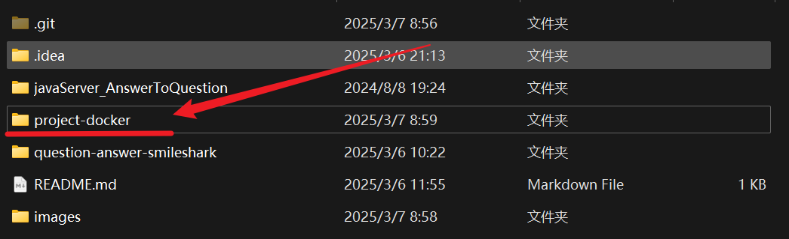

# 服务学校账号的项目
重庆足下软件学院

## 使用Docker部署

1. 进入`project-docker` 目录

   

2. 使用`docker-compose`（旧版）或`docker compose `（新版）

   `docker compose up -d `

3. Mysql 数据库需求：

   * 远程访问用户：`smileshark`
   * 远程访问密码：`smileshark123456`
   * 远程访问数据库：`school_question_data`

   sql文件有概率无法读取，可能需要手动执行：

   ```bash
   # 进入容器的数据库后使用init.sql文件
   > source /docker-entrypoint-initdb.d/init.sql
   ```

### **目前包括：**

* 自动评估
* 题目搜索

### **待开发：**

* 自动考试：获取考试页面题目
* 自动日精进：接入AI
  

*当前阶段：* 更新原始项目，技术进阶

## 更新日志：
> 2025/3/4 
>
> 规范`mysql` 数据库--->清除重复数据，规范数据库名、数据表名，建立明确数据关系
>
> 2025/3/5
>
> 1. 优化python代码，将大部分重复的代码整合，解决细小报错
> 2. 更新java代码为，更加系统化的结构
> 3. 修改MySQL数据库，将数据太大无法存入的字段的大小提升
> 4. 优化前端vue代码，使用更好的样式处理方式
>
> 2025/3/6
>
> 1. 添加功能：获得新课程时自动获取答案
> 2. 打包docker项目
>
> 2025/3/7
>
> 1. 编辑docker部署项目教程

